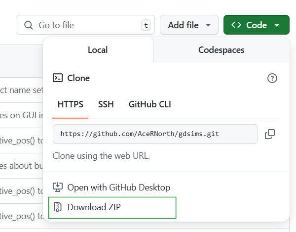

# GDSiMS
GDSiMS: the Gene Drive Simulator of Mosquito Spread is a metapopulation simulation program modelling mosquito populations and their response to gene drive release. The main aims of the project are to create a model program that is maintainable, extensible and widely accessible.

The full documentation website can be found [here](https://acernorth.github.io/gdsims/), which includes updated installation instructions, tutorials, a user guide and full API documentation.

## Requirements:
- C++20-compatible compiler or higher (e.g. MinGW g++ $\geq$ 8.0 for Windows, Clang $\geq$ 10 for Mac)
- CMake $\geq$ 3.5.0

## Installation

### Command Line: Windows
#### Additional Recommended Installations
- Git Bash

#### 
1. Open the Windows command prompt and check CMake and the C++ compiler have correctly been installed. The correct version should be set to run as default:
   
   ```bash
   cmake --version
   g++ --version
   ```
   
2. Downloading the files:
   
   i. Clone the repository via Git Bash (recommended):
   
      Install Git Bash and open. Navigate to your chosen directory and run this command to clone the repository:
     ```bash
     cd C:\Users\MyUser\Projects
     git clone https://github.com/AceRNorth/gdsims.git
     ```
   ii. Alternatively, download the files as a ZIP folder, unzip and move to your chosen directory.
   
   


3. Open the Windows command prompt again and navigate to your chosen directory.

   ```bash
   cd C:\Users\MyUser\Projects\gdsims
   ```

4. Create a directory called build where CMake files will be created, and navigate to it:

   ```bash
   mkdir build
   cd build
   ```

5. Run CMake to configure the CMake project:

   ```bash
   cmake ..
   ```

   This step might not succeed as some Windows systems have issues selecting a generator.
   You can run  ```cmake --help ``` to view a list of available generators and then run CMake with one of them,
   e.g.
   ```bash
   cmake -G "MinGW Makefiles" ..
   ```

6. Build all CMake targets:
   
   ```bash
   cmake --build .
   ```

7. Finally, run the executable file gdsimsapp.exe that has been created in the build directory
   ```bash
   gdsimsapp.exe
   ```

### Command Line: Linux

1. Open the command prompt and check CMake and the C++ compiler have correctly been installed. The correct version should be set to run as default:
   
   ```bash
   cmake --version
   g++ --version
   ```
  Some Linux distributions keep the default version set to an older version even after the newer one has been installed. A workaround to set this version will later be covered in step 5.
   
2. Clone the repository:
   Navigate to your chosen directory and run this command to clone the repository:
   
     ```bash
     cd ./Projects
     git clone https://github.com/AceRNorth/gdsims.git
     ```
     
3. Navigate to the repository directory:

   ```bash
   cd gdsims
   ```

5. Create a directory called build where CMake files will be created, and navigate to it:

   ```bash
   mkdir build
   cd build
   ```

6. Run CMake to configure the CMake project:

   ```bash
   cmake ..
   ```

   This step might not succeed if the default compiler version doesn't support C++17 and the <filesystem> library. 
   You can instead run it by setting the C++ compiler version,
   e.g.
   ```bash
   cmake -D CMAKE_CXX_COMPILER=g++13 ..
   ```

   If at any point you get CMake cache error messages, delete the CMakeCache file in the build directory and run cmake again.

7. Build all CMake targets:
   
   ```bash
   cmake --build .
   ```

8. Finally, run the executable file gdsimsapp that has been created in the build directory
   ```bash
   ./gdsimsapp
   ```

